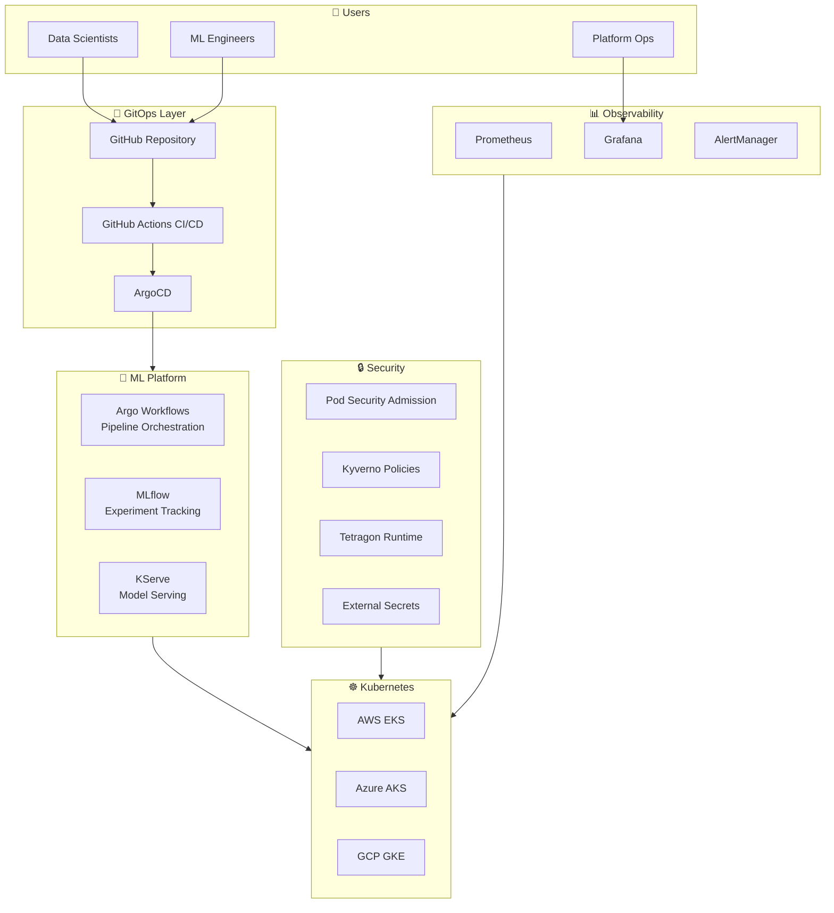
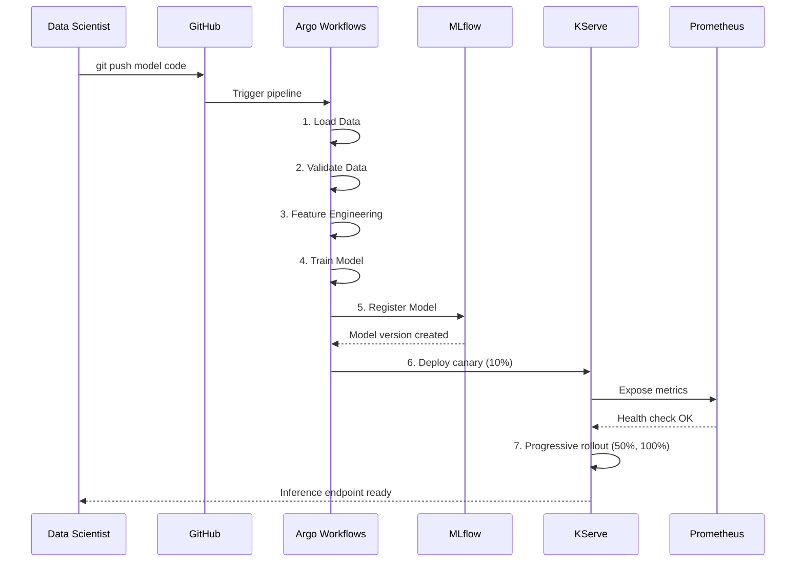
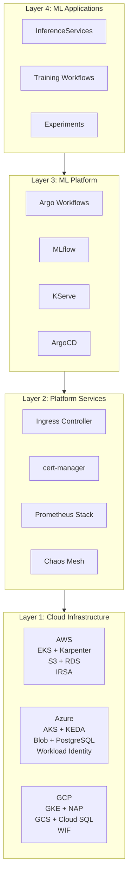
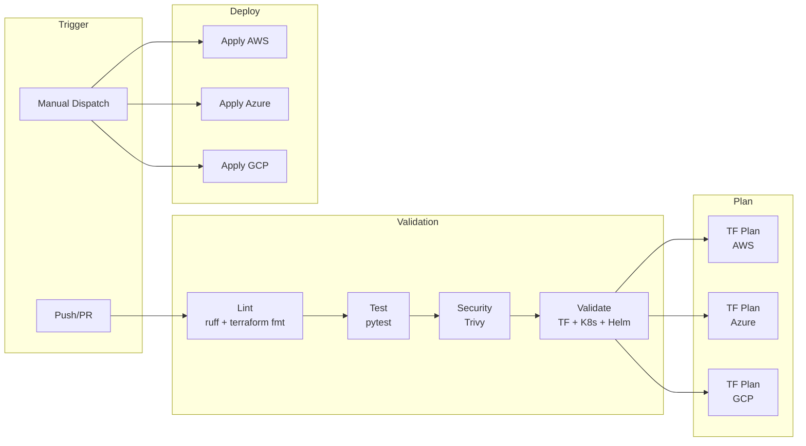

# MLOps Platform on Kubernetes

A production-ready, multi-cloud MLOps platform for model training, versioning, and deployment on **AWS EKS**, **Azure AKS**, or **GCP GKE**. Enables data science teams to go from experiment to production with self-service workflows.

[](https://github.com/judeoyovbaire/mlops-platform/actions/workflows/ci-cd.yaml)

## The Problem

ML teams often spend more time on infrastructure than on actual machine learning:

| Challenge | Traditional Approach | Time Cost |
|-----------|---------------------|-----------|
| Model deployment | Manual kubectl, Docker builds, config management | 2-3 days per model |
| Environment consistency | "Works on my machine" debugging | Hours of troubleshooting |
| Experiment tracking | Spreadsheets, local files, tribal knowledge | Lost experiments, no reproducibility |
| GPU resource management | Static allocation, idle resources | 60-70% underutilization |
| Production rollbacks | Manual intervention, downtime risk | 30+ minutes MTTR |

## The Solution

This platform provides self-service ML infrastructure where data scientists deploy models without DevOps tickets:

```
Data Scientist                    Platform (Automated)
     │                                    │
     ├── git push model code ────────────►├── CI validates & builds container
     │                                    ├── MLflow registers model version
     │                                    ├── KServe deploys with canary (10%)
     │                                    ├── Prometheus monitors latency/errors
     │                                    └── Auto-rollback if metrics degrade
     │                                    │
     └── Monitor in Grafana ◄─────────────┘
```

## Key Outcomes

| Metric | Before | After | Impact |
|--------|--------|-------|--------|
| Model deployment time | 2-3 days | 15 minutes | **95% faster** |
| Infrastructure setup per project | 40+ hours | 2 hours | **Self-service enablement** |
| GPU utilization | ~30% (static) | 70-85% (autoscaled) | **60% cost reduction on GPU** |
| Failed deployment recovery | 30+ min manual | <2 min auto-rollback | **Reduced MTTR** |
| Experiment reproducibility | Ad-hoc | 100% tracked | **Full audit trail** |

## Multi-Cloud Architecture

Deploy to **AWS**, **Azure**, or **GCP** — same MLOps capabilities, cloud-native implementations.

## Architecture Diagrams

### High-Level System Architecture



### ML Pipeline Flow



### Infrastructure Layers



### CI/CD Pipeline Flow



## Features

| Feature | AWS | Azure | GCP |
|---------|-----|-------|-----|
| **Pipeline Orchestration** | Argo Workflows | Argo Workflows | Argo Workflows |
| **Experiment Tracking** | MLflow + S3 + RDS | MLflow + Blob + PostgreSQL | MLflow + GCS + Cloud SQL |
| **Model Serving** | KServe (RawDeployment) | KServe (RawDeployment) | KServe (RawDeployment) |
| **GitOps** | ArgoCD | ArgoCD | ArgoCD |
| **GPU Autoscaling** | Karpenter | KEDA + Cluster Autoscaler | Node Auto-provisioning |
| **Ingress** | AWS ALB Controller | NGINX Ingress | NGINX Ingress |
| **Pod Identity** | IRSA | Workload Identity | Workload Identity Federation |
| **Secrets** | External Secrets + SSM | External Secrets + Key Vault | External Secrets + Secret Manager |
| **Security** | PSA, Kyverno, Tetragon | PSA, Kyverno, Tetragon | PSA, Kyverno, Tetragon |
| **Monitoring** | Prometheus + Grafana + Loki + Alloy + Tempo | Prometheus + Grafana + Loki + Alloy + Tempo | Prometheus + Grafana + Loki + Alloy + Tempo |
| **Network Observability** | VPC Flow Logs | NSG Flow Logs + Traffic Analytics | VPC Flow Logs |
| **Backup** | AWS Backup (RDS) | Built-in PostgreSQL Backup | Cloud SQL Backup |
| **Cost Management** | Cost Dashboard (Grafana) | Cost Dashboard (Grafana) | Cost Dashboard (Grafana) |
| **Resilience Testing** | Chaos Mesh | Chaos Mesh | Chaos Mesh |

## Tech Stack

| Component | Technology | Version | Purpose |
|-----------|------------|---------|---------|
| Pipeline Orchestration | Argo Workflows | 0.47.3 | ML workflow automation |
| Experiment Tracking | MLflow | 3.x (chart 1.8.1) | Model versioning & metrics |
| Model Serving | KServe | 0.16.0 | Production inference (CNCF) |
| GPU Autoscaling (AWS) | Karpenter | 1.8.3 | Dynamic GPU node provisioning |
| Event Autoscaling (Azure) | KEDA | 2.19.0 | Event-driven pod scaling |
| GPU Autoscaling (GCP) | GKE NAP | - | Node Auto-provisioning |
| GitOps | ArgoCD | 9.4.2 | Declarative deployments |
| Ingress (AWS) | AWS ALB Controller | 1.17.1 | External load balancing |
| Ingress (Azure/GCP) | NGINX Ingress | 4.14.3 | External load balancing |
| TLS | cert-manager | 1.19.3 | Certificate management |
| Monitoring | Prometheus + Grafana | 81.6.9 | Observability |
| Log Aggregation | Loki | 6.24.0 | Centralized logging |
| Distributed Tracing | Tempo | 1.15.0 | Request tracing |
| Log Shipping | Grafana Alloy | 0.12.0 | Pod log collection to Loki |
| Telemetry | OpenTelemetry Collector | 0.108.0 | Unified telemetry pipeline |
| Security Policy | Kyverno | 3.6.2 | Policy-as-code engine |
| Runtime Security | Tetragon | 1.6.0 | eBPF runtime monitoring |
| Secrets | External Secrets Operator | 1.2.1 | Cloud secrets sync |
| Resilience Testing | Chaos Mesh | 2.8.1 | Chaos engineering |
| Infrastructure | Terraform | >= 1.5.7 | IaC for EKS/AKS/GKE |
| CI/CD | GitHub Actions | - | Automated testing |

## Project Structure

```
mlops-platform/
├── .github/workflows/          # CI/CD pipeline (multi-cloud)
├── components/
│   └── drift-detection/        # Model drift detection service
├── docs/
│   ├── adr/                    # Architecture Decision Records
│   ├── runbooks/               # Operations and troubleshooting runbooks
│   ├── architecture.md         # Architecture documentation
│   ├── performance-tuning.md   # Performance optimization guide
│   └── ...                     # API reference, secrets, DR guides
├── examples/
│   ├── kserve/                 # Basic KServe inference examples
│   ├── canary-deployment/      # Progressive rollout with traffic splitting
│   ├── data-versioning/        # DVC integration examples
│   ├── distributed-training/   # PyTorch DDP with Kubeflow
│   ├── drift-detection/        # Model monitoring with Evidently
│   ├── chaos-testing/          # Resilience testing with Chaos Mesh
│   └── llm-inference/          # LLM serving with vLLM
├── infrastructure/
│   ├── grafana/dashboards/     # Grafana dashboard configurations
│   ├── kubernetes/
│   │   ├── dashboards/         # Kubernetes dashboard configs
│   │   └── governance/         # Kyverno model registry policies
│   ├── terraform/
│   │   ├── bootstrap/
│   │   │   ├── aws/            # AWS prerequisites (S3, GitHub OIDC)
│   │   │   ├── azure/          # Azure prerequisites (Storage, GitHub OIDC)
│   │   │   └── gcp/            # GCP prerequisites (GCS, Workload Identity)
│   │   ├── modules/
│   │   │   ├── eks/            # AWS EKS module
│   │   │   ├── aks/            # Azure AKS module
│   │   │   └── gke/            # GCP GKE module
│   │   └── environments/
│   │       ├── aws/{dev,prod}/ # AWS deployment configurations
│   │       ├── azure/{dev,prod}/ # Azure deployment configurations
│   │       └── gcp/{dev,prod}/ # GCP deployment configurations
│   └── helm/
│       ├── common/             # Shared Helm values
│       ├── aws/                # AWS-specific Helm values
│       ├── azure/              # Azure-specific Helm values
│       └── gcp/                # GCP-specific Helm values
├── pipelines/
│   ├── training/               # Iris training pipeline (Argo Workflow)
│   │   ├── src/                # Pipeline Python scripts
│   │   ├── kustomization.yaml  # ConfigMap generator
│   │   └── ml-training-workflow.yaml
│   └── pretrained/             # HuggingFace pretrained model pipeline
│       ├── src/                # fetch_model.py, register_model.py
│       └── hf-pretrained-workflow.yaml
├── scripts/
│   ├── common/                 # Shared script utilities
│   ├── cost-optimization/      # Cost analysis and reporting scripts
│   ├── deploy-{aws,azure,gcp}.sh
│   └── destroy-{aws,azure,gcp}.sh
├── tests/                      # Unit and integration tests
└── Makefile                    # Common operations
```

## Getting Started

### Prerequisites

**For AWS:**
- AWS account with appropriate permissions
- AWS CLI configured (`aws configure`)

**For Azure:**
- Azure subscription
- Azure CLI configured (`az login`)

**For GCP:**
- GCP project with billing enabled
- Google Cloud SDK configured (`gcloud auth login && gcloud config set project <PROJECT_ID>`)
- gke-gcloud-auth-plugin (`gcloud components install gke-gcloud-auth-plugin`)

**Common:**
- Terraform >= 1.5.7
- kubectl
- Helm 3.x
- Python 3.10+

### Quick Start

```bash
git clone https://github.com/judeoyovbaire/mlops-platform.git
cd mlops-platform

# 1. Bootstrap cloud resources (run once per cloud)
cd infrastructure/terraform/bootstrap/aws    # or azure/ or gcp/
terraform init && terraform apply
cd -

# 2. Deploy the platform (~15-25 minutes)
make deploy-aws     # or deploy-azure, deploy-gcp

# 3. Access dashboards
make port-forward-mlflow   # http://localhost:5000
make port-forward-argocd   # https://localhost:8080
make port-forward-grafana  # http://localhost:3000
```

See **[QUICKSTART.md](QUICKSTART.md)** for deploying a model, running a training pipeline, and testing inference end-to-end.

Run `make help` for all available commands.

## CI/CD Pipeline

Single unified pipeline with OIDC authentication for all clouds (no static credentials):

| Trigger | What Happens |
|---------|--------------|
| **Push/PR** | Validate code, run tests, security scan, show terraform plan for all clouds |
| **Manual: `aws` + `deploy-infra`** | Deploy AWS EKS infrastructure via Terraform |
| **Manual: `azure` + `deploy-infra`** | Deploy Azure AKS infrastructure via Terraform |
| **Manual: `gcp` + `deploy-infra`** | Deploy GCP GKE infrastructure via Terraform |
| **Manual: `deploy-model`** | Deploy example InferenceServices to KServe |
| **Local: `make destroy-*`** | Destroy infrastructure (safety - not in pipeline) |

### Setup GitHub Secrets

**For AWS:**
```bash
terraform -chdir=infrastructure/terraform/bootstrap/aws output github_actions_role_arn
# Add to GitHub: Settings > Secrets > AWS_ROLE_ARN
```

**For Azure:**
```bash
terraform -chdir=infrastructure/terraform/bootstrap/azure output -json
# Add to GitHub: AZURE_CLIENT_ID, AZURE_TENANT_ID, AZURE_SUBSCRIPTION_ID
```

**For GCP:**
```bash
terraform -chdir=infrastructure/terraform/bootstrap/gcp output -json
# Add to GitHub: GCP_PROJECT_ID, GCP_WORKLOAD_IDENTITY_PROVIDER, GCP_SERVICE_ACCOUNT
```

## Cloud Resources

### AWS Resources

| Resource | Purpose |
|----------|---------|
| VPC | Networking with public/private subnets across 3 AZs |
| EKS Cluster | Managed Kubernetes control plane (v1.34) |
| Node Groups | General (t3.large), Training (SPOT), GPU (g4dn SPOT) |
| S3 Bucket | MLflow artifact storage |
| RDS PostgreSQL | MLflow metadata backend |
| ECR Repository | Container images for ML models |
| IAM Roles | IRSA for secure pod authentication |
| ALB | External access to services |
| VPC Flow Logs | Network traffic logging to CloudWatch |
| AWS Backup | Automated RDS backups (daily/weekly) |

### Azure Resources

| Resource | Purpose |
|----------|---------|
| Virtual Network | Networking with AKS and PostgreSQL subnets |
| AKS Cluster | Managed Kubernetes (v1.34) |
| Node Pools | System, Training (Spot), GPU (Spot) |
| Storage Account | MLflow artifact storage (Blob) |
| PostgreSQL Flexible Server | MLflow metadata backend |
| Container Registry | Container images for ML models |
| Managed Identities | Workload Identity for pod authentication |
| Key Vault | Secrets management |
| NSG Flow Logs | Network traffic logging with Traffic Analytics |
| Network Watcher | Network monitoring and diagnostics |

### GCP Resources

| Resource | Purpose |
|----------|---------|
| VPC Network | Networking with Cloud NAT for egress |
| GKE Standard Cluster | Managed Kubernetes (v1.33, Stable channel) |
| Node Pools | System (e2-standard-4), Training (Spot), GPU (T4, Spot) |
| GCS Bucket | MLflow artifact storage |
| Cloud SQL PostgreSQL | MLflow metadata backend (v17) |
| Artifact Registry | Container images for ML models |
| Workload Identity Federation | Pod authentication |
| Secret Manager | Secrets management |
| Node Auto-provisioning | Dynamic GPU node scaling |

### Cost Estimation

**AWS (eu-west-1):**

| Resource | Configuration | Monthly Cost |
|----------|---------------|--------------|
| EKS Cluster | Control plane | $73 |
| General Nodes | 2x t3.large (ON_DEMAND) | ~$120 |
| Training Nodes | c5.2xlarge (SPOT, scale-to-zero) | ~$30-50 |
| GPU Nodes | g4dn.xlarge (SPOT, scale-to-zero) | ~$50-100 |
| NAT Gateway | Single (cost optimization) | ~$45 |
| RDS PostgreSQL | db.t3.small | ~$25 |
| S3 + ALB | Minimal usage | ~$10-20 |
| **Total** | | **~$350-450/month** |

**Azure (westeurope):**

| Resource | Configuration | Monthly Cost |
|----------|---------------|--------------|
| AKS Control Plane | Free tier | $0 |
| System Nodes | 2x Standard_D2s_v3 | ~$140 |
| Training Nodes | Standard_D8s_v3 (Spot, scale-to-zero) | ~$30-50 |
| GPU Nodes | Standard_NC6s_v3 (Spot, scale-to-zero) | ~$50-100 |
| PostgreSQL | B_Standard_B1ms | ~$15 |
| Storage Account | Standard LRS | ~$5 |
| Key Vault + Load Balancer | Standard | ~$23 |
| **Total** | | **~$260-330/month** |

**GCP (europe-west4):**

| Resource | Configuration | Monthly Cost |
|----------|---------------|--------------|
| GKE Control Plane | Zonal (free tier) | $0 |
| System Nodes | 2x e2-standard-4 | ~$100 |
| Training Nodes | c2-standard-8 (Spot, scale-to-zero) | ~$30-50 |
| GPU Nodes | n1-standard-8 + T4 (Spot, scale-to-zero) | ~$50-100 |
| Cloud SQL | db-f1-micro | ~$10 |
| GCS Storage | Standard | ~$5 |
| Cloud NAT + Artifact Registry | Minimal | ~$10-20 |
| **Total** | | **~$200-350/month** |

**Cost Optimization:**
- SPOT/Preemptible instances for training/GPU: 60-70% savings
- Scale-to-zero: Training and GPU nodes only run when needed
- Single NAT Gateway (AWS) / Standard LB (Azure) / Cloud NAT (GCP)
- GKE Zonal cluster for dev (free control plane)

## Roadmap

### Completed
- [x] **Multi-cloud infrastructure** — EKS, AKS, GKE with GPU autoscaling (Karpenter / KEDA / NAP)
- [x] **ML platform** — MLflow 3.x, KServe, Argo Workflows, ArgoCD
- [x] **Observability** — Prometheus, Grafana, Loki, Alloy, Tempo, cost dashboards
- [x] **Security** — PSA, Kyverno, Tetragon, External Secrets, network policies
- [x] **CI/CD** — GitHub Actions with OIDC auth, multi-cloud plan/deploy, Trivy scanning
- [x] **Production readiness** — dev/prod configs, backup, VPC Flow Logs, drift detection
- [x] **Examples** — distributed training, data versioning, canary deploys, chaos testing, LLM inference
- [x] **Pipelines** — Iris training pipeline + HuggingFace pretrained model pipeline

### Future Enhancements
- [ ] A/B testing framework for model comparison
- [ ] Feature store integration (Feast)
- [ ] Model explainability dashboards (SHAP/LIME)

## Examples

| Example | Description | Complexity |
|---------|-------------|------------|
| [KServe Basic](examples/kserve/) | sklearn model with production config | Beginner |
| [Canary Deployment](examples/canary-deployment/) | Progressive rollout with traffic splitting | Intermediate |
| [Data Versioning](examples/data-versioning/) | DVC integration for dataset management | Intermediate |
| [Distributed Training](examples/distributed-training/) | PyTorch DDP with Kubeflow Training Operator | Advanced |
| [LLM Inference](examples/llm-inference/) | Mistral-7B with vLLM on GPU | Advanced |
| [Drift Detection](examples/drift-detection/) | Model monitoring with Evidently | Advanced |
| [HuggingFace Sentiment](examples/kserve/huggingface-sentiment.yaml) | Pretrained HF model via KServe | Intermediate |
| [Chaos Testing](examples/chaos-testing/) | Resilience testing with Chaos Mesh | Advanced |

## Why These Tools?

### MLflow 3.x over alternatives
- Open source, framework-agnostic
- Native GenAI/LLM support (prompt versioning, agent tracing)
- Model aliases replace deprecated staging workflow
- Largest community adoption

### KServe over Seldon Core
- **Licensing**: Seldon Core moved to BSL 1.1 (paid for commercial use as of Jan 2024)
- KServe is fully open source (Apache 2.0), CNCF Incubating project
- Better PyTorch support out-of-the-box
- Serverless inference with scale-to-zero

### Multi-Cloud Architecture
- Same MLOps capabilities on AWS, Azure, or GCP
- Cloud-native implementations (IRSA vs Workload Identity vs WIF, Karpenter vs KEDA vs NAP)
- Demonstrates enterprise-grade infrastructure patterns
- Flexibility to deploy where your data resides
- OIDC authentication throughout (no static credentials)

## Documentation

| Category | Documents |
|----------|-----------|
| **Getting Started** | [Quick Start Guide](QUICKSTART.md) - Deploy your first model in 5 minutes |
| **Architecture** | [Architecture Deep Dive](docs/architecture.md) - System design and components |
| **Security** | [Secrets Management](docs/secrets-management.md) - Credential rotation |
| **Operations** | [Operations Runbook](docs/runbooks/operations.md) - Day-to-day procedures |
| **Troubleshooting** | [Troubleshooting Guide](docs/runbooks/troubleshooting.md) - Common issues |
| **Performance** | [Performance Tuning](docs/performance-tuning.md) - Optimize inference & training |
| **Disaster Recovery** | [DR Guide](docs/disaster-recovery.md) - Backup & recovery procedures |
| **API Reference** | [API Reference](docs/api-reference.md) - MLflow & KServe APIs |
| **Examples** | [LLM Inference](examples/llm-inference/README.md) - GPU-based model serving |

## License

MIT License - see LICENSE for details.

## Author

**Jude Oyovbaire** - Senior Platform & DevOps Engineer

- Website: [judaire.io](https://judaire.io)
- LinkedIn: [linkedin.com/in/judeoyovbaire](https://linkedin.com/in/judeoyovbaire)
- GitHub: [github.com/judeoyovbaire](https://github.com/judeoyovbaire)
