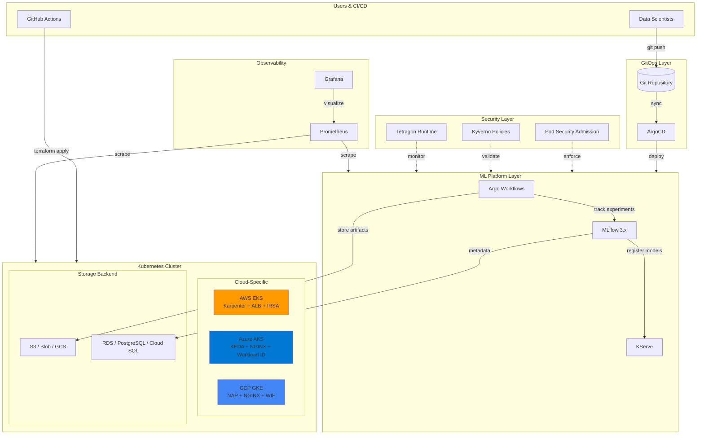

# Architecture Deep Dive

## Overview

The MLOps Platform is designed to provide a complete ML lifecycle management solution on **AWS EKS**, **Azure AKS**, or **GCP GKE**. It follows cloud-native principles and enables teams to build, train, deploy, and monitor ML models at scale with the same capabilities on any cloud.

## System Architecture



## Multi-Cloud Design

The platform uses a layered architecture that maximizes code reuse while leveraging cloud-native services:

```
┌─────────────────────────────────────────────────────────────────────────────┐
│                         Application Layer (Cloud-Agnostic)                  │
│  ┌──────────────┐  ┌──────────────┐  ┌──────────────┐  ┌──────────────┐     │
│  │    MLflow    │  │   KServe     │  │    Argo      │  │   ArgoCD     │     │
│  │   Tracking   │  │   Serving    │  │  Workflows   │  │    GitOps    │     │
│  └──────────────┘  └──────────────┘  └──────────────┘  └──────────────┘     │
├─────────────────────────────────────────────────────────────────────────────┤
│                         Platform Layer (Cloud-Agnostic)                     │
│  ┌──────────────┐  ┌──────────────┐  ┌──────────────┐  ┌──────────────┐     │
│  │  Prometheus  │  │   Kyverno    │  │   Tetragon   │  │ cert-manager │     │
│  │   Grafana    │  │   Policies   │  │   Security   │  │     TLS      │     │
│  └──────────────┘  └──────────────┘  └──────────────┘  └──────────────┘     │
├─────────────────────────────────────────────────────────────────────────────┤
│                         Infrastructure Layer (Cloud-Specific)               │
│                                                                             │
│  AWS EKS                    │  Azure AKS                │  GCP GKE                    │
│  ──────────────────────────│──────────────────────────│────────────────────────────  │
│  • Karpenter (GPU scaling) │  • KEDA (event-driven)   │  • NAP (auto-provisioning)  │
│  • ALB Ingress Controller  │  • NGINX Ingress         │  • NGINX Ingress            │
│  • S3 + RDS PostgreSQL     │  • Blob + PostgreSQL     │  • GCS + Cloud SQL          │
│  • IRSA (pod identity)     │  • Workload Identity     │  • Workload Identity Fed    │
│  • Secrets Manager         │  • Azure Key Vault       │  • Secret Manager           │
│  • ECR (registry)          │  • ACR (registry)        │  • Artifact Registry        │
│                                                                             │
└─────────────────────────────────────────────────────────────────────────────┘
```

## Core Components

### 1. Argo Workflows

Argo Workflows orchestrates ML workflows as directed acyclic graphs (DAGs). Each step in a pipeline runs as a container, enabling reproducibility and scalability.

**Key Features:**
- Kubernetes-native workflow engine
- DAG and step-based workflow definitions
- Artifact passing between steps
- Caching and memoization for faster iteration
- Integration with MLflow for experiment tracking

```yaml
# Example workflow structure
apiVersion: argoproj.io/v1alpha1
kind: Workflow
metadata:
  name: ml-training-pipeline
spec:
  entrypoint: ml-pipeline
  templates:
    - name: ml-pipeline
      dag:
        tasks:
          - name: data-ingestion
          - name: data-validation
            dependencies: [data-ingestion]
          - name: feature-engineering
            dependencies: [data-validation]
          - name: model-training
            dependencies: [feature-engineering]
          - name: model-evaluation
            dependencies: [model-training]
```

### 2. MLflow 3.x

MLflow provides the experiment tracking and model registry capabilities.

**Components:**
- **Tracking Server**: Logs parameters, metrics, and artifacts
- **Model Registry**: Central repository for model versions with aliases
- **Backend Store**: PostgreSQL for metadata (RDS on AWS, Flexible Server on Azure)
- **Artifact Store**: Object storage (S3 on AWS, Blob on Azure)

**New in MLflow 3.x:**
- Model aliases replace deprecated staging workflow
- Native GenAI/LLM support (prompt versioning, agent tracing)
- Model Context Protocol (MCP) server integration

**Architecture:**
```
                    AWS                                    Azure
┌─────────────────┐     ┌──────────────┐    ┌─────────────────┐     ┌──────────────┐
│  Training Job   │────▶│ MLflow Server│    │  Training Job   │────▶│ MLflow Server│
└─────────────────┘     └──────┬───────┘    └─────────────────┘     └──────┬───────┘
                               │                                           │
                  ┌────────────┴────────────┐             ┌────────────────┴────────────┐
                  │                         │             │                             │
            ┌─────▼─────┐           ┌───────▼───────┐   ┌─▼────────────┐     ┌─────────▼─────────┐
            │ RDS       │           │  S3 Bucket    │   │ PostgreSQL   │     │  Blob Storage     │
            │ PostgreSQL│           │  (artifacts)  │   │ Flexible     │     │  (artifacts)      │
            └───────────┘           └───────────────┘   └──────────────┘     └───────────────────┘
```

### 3. KServe

KServe (CNCF Incubating) handles model serving with advanced deployment strategies. It replaced Seldon Core due to licensing changes (Seldon moved to BSL 1.1 in Jan 2024).

**Features:**
- RawDeployment mode (no Knative required)
- Canary deployments with traffic splitting
- Native support for sklearn, PyTorch, TensorFlow, vLLM
- MLflow model integration
- Autoscaling with HPA/KEDA

**Deployment Example:**
```yaml
# Canary Deployment Configuration
apiVersion: serving.kserve.io/v1beta1
kind: InferenceService
metadata:
  name: sklearn-iris-canary
spec:
  predictor:
    canaryTrafficPercent: 10
    model:
      modelFormat:
        name: sklearn
      storageUri: s3://models/sklearn/iris  # or wasbs:// for Azure
```

### 4. LLM Inference with vLLM

The platform includes support for LLM inference using vLLM on GPU nodes:

**Features:**
- PagedAttention for efficient memory management
- Continuous batching for high throughput
- OpenAI-compatible API endpoints
- Scale-to-zero for cost optimization

**Example Deployment:**
```yaml
apiVersion: serving.kserve.io/v1beta1
kind: InferenceService
metadata:
  name: llm-mistral
spec:
  predictor:
    containers:
      - name: kserve-container
        image: vllm/vllm-openai:v0.8.0
        args:
          - --model=mistralai/Mistral-7B-Instruct-v0.2
          - --max-model-len=4096
          - --gpu-memory-utilization=0.9
        resources:
          limits:
            nvidia.com/gpu: "1"
```

**Included Models:**

| Model               | Size | GPU Memory | Use Case        |
|---------------------|------|------------|-----------------|
| Mistral-7B-Instruct | 7B   | ~14GB      | General purpose |
| TinyLlama-1.1B      | 1.1B | ~4GB       | Testing, demos  |
| CodeLlama-7B        | 7B   | ~14GB      | Code generation |

### 5. GPU Autoscaling

**AWS: Karpenter**

Karpenter provides just-in-time node provisioning for GPU and training workloads:

- Faster node provisioning than Cluster Autoscaler
- Native SPOT instance support with fallback to on-demand
- Right-sizing: Provisions optimal instance types automatically
- Consolidation: Removes underutilized nodes to reduce costs

**NodePools Configured:**

| NodePool | Instance Types | Capacity | Taints |
|----------|---------------|----------|--------|
| gpu-workloads | g4dn, g5, p3, p4d | SPOT preferred | `nvidia.com/gpu=true:NoSchedule` |
| training-workloads | c5, m5, r5 (xlarge-4xlarge) | SPOT only | `workload=training:NoSchedule` |

**Azure: KEDA + Cluster Autoscaler**

KEDA provides event-driven pod autoscaling that triggers Cluster Autoscaler:

- Event-driven scaling based on Prometheus metrics
- Queue-based scaling for training workloads
- HTTP-based scaling for inference workloads
- Integrates with Azure Workload Identity

**ScaledObjects Configured:**

| ScaledObject | Trigger | Namespace | Target |
|--------------|---------|-----------|--------|
| gpu-workload-scaler | Prometheus (pending GPU pods) | mlops | GPU deployments |
| training-workload-scaler | Prometheus (Argo queue depth) | mlops | Training workers |
| inference-workload-scaler | Prometheus (HTTP request rate) | mlops | Inference workers |

### 6. GitOps with ArgoCD

All platform configurations are managed through Git, enabling:
- Version-controlled infrastructure
- Automated sync and drift detection
- Rollback capabilities
- Multi-environment promotion

## Cloud Providers

The platform supports AWS, Azure, and GCP with production-ready Terraform modules:

| Cloud | Module         | Status             | Key Services                            |
|-------|----------------|--------------------|-----------------------------------------|
| AWS   | `modules/eks`  | **Production Ready** | EKS, S3, RDS, ALB, IRSA               |
| Azure | `modules/aks`  | **Production Ready** | AKS, Blob, PostgreSQL, Key Vault, ACR |
| GCP   | `modules/gke`  | **Production Ready** | GKE, GCS, Cloud SQL, Secret Manager   |

The Kubernetes layer (KServe, MLflow, ArgoCD) is cloud-agnostic and works identically on all providers.

## Infrastructure

### AWS Infrastructure

**Terraform Structure:**
```
infrastructure/terraform/
├── bootstrap/aws/       # AWS prerequisites (S3, GitHub OIDC)
├── modules/eks/         # AWS EKS module
│   ├── main.tf          # VPC, EKS cluster, node groups, S3, RDS, IRSA
│   ├── variables.tf     # Configurable inputs
│   └── outputs.tf       # Cluster endpoints, ARNs
└── environments/aws/dev/# Main deployment configuration
    ├── providers.tf     # AWS + Kubernetes providers
    ├── eks.tf           # EKS module instantiation
    ├── helm-core.tf     # Helm releases
    └── ...
```

**Node Groups:**
- **General**: Platform services (t3.large, ON_DEMAND)
- **Training**: ML training jobs (c5.2xlarge, SPOT, scale-to-zero)
- **GPU**: GPU workloads (g4dn.xlarge, SPOT, scale-to-zero)

**AWS Resources Created:**
- VPC with public/private subnets across 3 AZs
- EKS cluster with managed node groups
- S3 bucket for MLflow artifacts
- RDS PostgreSQL for MLflow metadata
- IAM roles with IRSA for secure pod authentication
- AWS Load Balancer Controller for ALB Ingress
- VPC Flow Logs with CloudWatch integration
- AWS Backup vault with daily/weekly backup plans

### Azure Infrastructure

**Terraform Structure:**
```
infrastructure/terraform/
├── bootstrap/azure/     # Azure prerequisites (Storage, GitHub OIDC)
├── modules/aks/         # Azure AKS module
│   ├── main.tf          # VNet, AKS cluster, node pools
│   ├── workload-identity.tf  # Managed identities
│   ├── storage.tf       # Blob, PostgreSQL, Key Vault, ACR
│   ├── variables.tf
│   └── outputs.tf
└── environments/azure/dev/  # Main deployment configuration
    ├── providers.tf     # Azure + Kubernetes providers
    ├── aks.tf           # AKS module instantiation
    ├── keda.tf          # KEDA autoscaling
    ├── helm-core.tf     # Helm releases
    └── ...
```

**Node Pools:**
- **System**: Platform services (Standard_D4s_v3, autoscale 2-4)
- **Training**: ML training jobs (Standard_D8s_v3, Spot, scale-to-zero)
- **GPU**: GPU workloads (Standard_NC6s_v3, Spot, scale-to-zero)

**Azure Resources Created:**
- Virtual Network with AKS and PostgreSQL subnets
- AKS cluster with OIDC and Workload Identity
- Storage Account for MLflow artifacts (Blob)
- PostgreSQL Flexible Server for MLflow metadata
- Azure Key Vault for secrets
- Azure Container Registry (ACR)
- Managed Identities with federated credentials
- NGINX Ingress Controller with Azure Load Balancer
- NSG Flow Logs with Traffic Analytics
- Network Watcher for network diagnostics

### Helm Releases (via Terraform)

All environments deploy the same components with cloud-specific configurations:

| Component                    | AWS Chart                                | Azure/GCP Chart                |
|------------------------------|------------------------------------------|--------------------------------|
| Ingress                      | eks-charts/aws-load-balancer-controller  | ingress-nginx/ingress-nginx    |
| cert-manager                 | jetstack/cert-manager                    | jetstack/cert-manager          |
| ArgoCD                       | argo/argo-cd                             | argo/argo-cd                   |
| KServe CRDs                  | kserve/kserve-crd                        | kserve/kserve-crd              |
| KServe Controller            | kserve/kserve                            | kserve/kserve                  |
| MLflow                       | community-charts/mlflow                  | community-charts/mlflow        |
| Argo Workflows               | argo/argo-workflows                      | argo/argo-workflows            |
| Prometheus Stack             | prometheus-community/kube-prometheus-stack | prometheus-community/kube-prometheus-stack |
| Loki                         | grafana/loki                             | grafana/loki                   |
| Tempo                        | grafana/tempo                            | grafana/tempo                  |
| OpenTelemetry Collector      | open-telemetry/opentelemetry-collector   | open-telemetry/opentelemetry-collector |
| External Secrets             | external-secrets/external-secrets        | external-secrets/external-secrets |
| Kyverno                      | kyverno/kyverno                          | kyverno/kyverno                |
| Tetragon                     | cilium/tetragon                          | cilium/tetragon                |
| GPU Autoscaling              | karpenter/karpenter                      | kedacore/keda (Azure)          |

## Data Flow

```
┌─────────┐    ┌──────────┐    ┌─────────┐    ┌──────────┐    ┌────────┐
│  Data   │───▶│ Feature  │───▶│ Train   │───▶│ Register │───▶│ Serve  │
│ Source  │    │  Store   │    │ Model   │    │  Model   │    │ Model  │
└─────────┘    └──────────┘    └─────────┘    └──────────┘    └────────┘
     │              │               │              │               │
     └──────────────┴───────────────┴──────────────┴───────────────┘
                              │
                    ┌─────────▼────────────┐
                    │     Observability    │
                    │ (Prometheus/Grafana) │
                    └──────────────────────┘
```

## Infrastructure Layers

### Layer 1: Cloud Infrastructure
**AWS:**
- VPC with public/private subnets
- EKS cluster with managed node groups
- RDS PostgreSQL for MLflow
- S3 for artifact storage
- ALB for external access

**Azure:**
- Virtual Network with subnets
- AKS cluster with node pools
- PostgreSQL Flexible Server
- Blob Storage for artifacts
- Azure Load Balancer with NGINX Ingress

### Layer 2: Platform Services
- Ingress Controller (ALB or NGINX)
- cert-manager for TLS
- Prometheus/Grafana for monitoring
- External Secrets Operator

### Layer 3: ML Platform
- Argo Workflows
- MLflow 3.x
- KServe (RawDeployment mode)
- ArgoCD for GitOps

### Layer 4: Applications
- Training pipelines
- Inference services
- Feature stores
- Monitoring dashboards

## Security Architecture

The platform implements defense-in-depth security across multiple layers:

```
┌─────────────────────────────────────────────────────────────────────────────┐
│                         Security Architecture                               │
├─────────────────────────────────────────────────────────────────────────────┤
│                                                                             │
│  ┌─────────────────┐  ┌──────────────────┐  ┌────────────────────────────┐  │
│  │ Pod Security    │  │ Policy Engine    │  │ Runtime Security           │  │
│  │ Standards (PSA) │  │ (Kyverno)        │  │ (Tetragon)                 │  │
│  ├─────────────────┤  ├──────────────────┤  ├────────────────────────────┤  │
│  │ Enforces:       │  │ Validates:       │  │ Monitors:                  │  │
│  │ - baseline mode │  │ - Resource limits│  │ - Sensitive file access    │  │
│  │ - restricted    │  │ - Image tags     │  │ - Container escapes        │  │
│  │   (audit/warn)  │  │ - Registries     │  │ - Network connections      │  │
│  │                 │  │ - Labels         │  │ - Process execution        │  │
│  └─────────────────┘  └──────────────────┘  └────────────────────────────┘  │
│                                                                             │
└─────────────────────────────────────────────────────────────────────────────┘
```

### Pod Security Standards (PSA)

Native Kubernetes pod security using namespace labels:

| Namespace | Enforce Level | Warn Level | Audit Level | Rationale |
|-----------|---------------|------------|-------------|-----------|
| `mlops` | **restricted** | restricted | restricted | ML inference workloads (hardened) |
| `mlflow` | **restricted** | restricted | restricted | Experiment tracking (stateless) |
| `kserve` | **restricted** | restricted | restricted | Model serving controller |
| `argo` | baseline | restricted | restricted | Pipeline executor needs elevated perms |
| `monitoring` | privileged | - | - | Node-exporter needs hostPath |
| `kyverno` | privileged | - | - | Admission controller |
| `tetragon` | privileged | - | - | eBPF runtime security |

### Kyverno Policy Engine

Kubernetes-native policy engine (CNCF Incubating) providing policy-as-code:

**Cluster Policies:**

| Policy | Scope | Action | Purpose |
|--------|-------|--------|---------|
| `require-resource-limits` | ML namespaces | Audit | Prevent resource exhaustion |
| `disallow-latest-tag` | mlops, kserve | Audit | Ensure reproducibility |
| `require-mlops-labels` | mlops | Audit | Model traceability |
| `restrict-image-registries` | mlops, kserve | Audit | Supply chain security |
| `add-default-networkpolicy` | New namespaces | Generate | Zero-trust networking |

### Tetragon Runtime Security

eBPF-based runtime security from the Cilium project:

**Tracing Policies:**

| Policy | Detection | Namespaces |
|--------|-----------|------------|
| `sensitive-file-access` | Access to /etc/shadow, SSH keys, K8s secrets | mlops, argo, kserve |
| `container-escape-detection` | ptrace, setns syscalls | mlops, argo, kserve |
| `ml-network-connections` | Outbound TCP connections | mlops, kserve |
| `suspicious-process-execution` | wget, curl, nc in inference pods | kserve |

### Cloud-Specific Identity

**AWS: IRSA (IAM Roles for Service Accounts)**
- Pod-level IAM roles
- No static credentials
- Automatic credential rotation

**Azure: Workload Identity**
- Federated credentials with Azure AD
- No static credentials
- Managed Identity per workload

### Security Layers

```
┌───────────────────────────────────────────────────────────────┐
│                    Security Layers                            │
├───────────────────────────────────────────────────────────────┤
│  Network Policies      │  Pod Security    │  RBAC             │
│  ─────────────────     │  ─────────────   │  ──────           │
│  - Namespace isolation │  - Non-root      │  - Role per       │
│  - Ingress/Egress      │  - Read-only FS  │    namespace      │
│  - VPC security groups │  - Capabilities  │  - Least          │
│  - Kyverno auto-gen    │  - PSA labels    │    privilege      │
├───────────────────────────────────────────────────────────────┤
│  Pod Identity          │  Image Security  │  Runtime          │
│  ─────────────────     │  ──────────────  │  ─────────        │
│  - IRSA (AWS)          │  - Kyverno       │  - Tetragon       │
│  - Workload ID (Azure) │    registry      │  - eBPF tracing   │
│  - No static creds     │    allowlist     │  - Prometheus     │
│                        │  - No :latest    │    metrics        │
└───────────────────────────────────────────────────────────────┘
```

## Observability

### Network Observability

The platform provides comprehensive network visibility across all cloud providers:

**AWS: VPC Flow Logs**
```hcl
resource "aws_flow_log" "main" {
  vpc_id                   = module.vpc.vpc_id
  traffic_type             = "ALL"
  log_destination_type     = "cloud-watch-logs"
  log_destination          = aws_cloudwatch_log_group.flow_logs.arn
  max_aggregation_interval = 60  # 1-minute granularity
}
```

Flow logs are stored in CloudWatch with configurable retention (default: 30 days) and can be analyzed using CloudWatch Logs Insights for:
- Network traffic patterns
- Security incident investigation
- Connection troubleshooting
- Compliance auditing

**Azure: NSG Flow Logs with Traffic Analytics**
```hcl
resource "azurerm_network_watcher_flow_log" "aks" {
  network_security_group_id = azurerm_network_security_group.aks.id
  storage_account_id        = azurerm_storage_account.flow_logs.id
  version                   = 2

  traffic_analytics {
    enabled               = true
    workspace_id          = azurerm_log_analytics_workspace.main.workspace_id
    interval_in_minutes   = 10
  }
}
```

Traffic Analytics provides:
- Visual traffic flow maps
- Geo-mapped traffic sources
- Bandwidth utilization insights
- Security threat detection

**GCP: VPC Flow Logs**
```hcl
log_config {
  aggregation_interval = "INTERVAL_5_SEC"
  flow_sampling        = 0.5
  metadata             = "INCLUDE_ALL_METADATA"
}
```

GCP flow logs capture packet samples with configurable sampling rates for cost optimization.

### Cost Dashboard

A comprehensive Grafana dashboard for cloud cost monitoring is included:

**Dashboard Panels:**
| Panel | Metric | Description |
|-------|--------|-------------|
| Estimated Monthly Cost | `sum(kube_pod_container_resource_requests)` | Projected monthly spend |
| Cost by Namespace | Resource requests × pricing | Breakdown by team/project |
| CPU Efficiency | Usage ÷ Requests | Optimization opportunities |
| Memory Efficiency | Usage ÷ Requests | Over-provisioning detection |
| GPU Utilization | `DCGM_FI_DEV_GPU_UTIL` | GPU cost optimization |
| Resource Waste | Requests - Usage | Wasted capacity costs |

**Location:** `infrastructure/kubernetes/dashboards/cloud-cost-dashboard.yaml`

The dashboard uses node labels and resource pricing to estimate costs:
- CPU: $0.048/core/hour
- Memory: $0.006/GB/hour
- GPU: $0.526/GPU/hour

### Prometheus Monitoring

The platform includes ServiceMonitors for metrics collection:

```yaml
# infrastructure/kubernetes/monitoring.yaml
- ServiceMonitor: mlflow          # MLflow tracking server
- ServiceMonitor: kserve-inference # Inference services
- ServiceMonitor: keda            # KEDA metrics (Azure)
- PodMonitor: argo-workflows      # Pipeline runs
```

### Alerting Rules

Pre-configured PrometheusRules for common issues:

| Alert                    | Condition               | Severity |
|--------------------------|-------------------------|----------|
| HighInferenceLatency     | P95 > 1s for 5m         | warning  |
| HighInferenceErrorRate   | >5% errors for 5m       | critical |
| InferenceServiceRestarts | >3 restarts/hour        | warning  |
| MLflowDown               | Server unreachable 2m   | critical |
| HighPipelineFailureRate  | >10% failures/hour      | warning  |
| LowGPUUtilization        | <20% for 30m            | info     |
| KEDAScalerErrors         | Scaler errors (Azure)   | warning  |

### Grafana Dashboard

A pre-built dashboard is included as a ConfigMap:
- Inference requests/sec
- P95 latency by model
- Active models count
- Error rate percentage
- Request rate by model

## Scalability Considerations

### Horizontal Scaling
- Argo Workflows: Multiple workflow controllers
- MLflow: Stateless tracking server behind load balancer
- KServe: HPA based on inference latency/throughput

### GPU Resource Management
```yaml
# GPU quota per namespace
apiVersion: v1
kind: ResourceQuota
metadata:
  name: gpu-quota
spec:
  hard:
    nvidia.com/gpu: "4"
```

### Cost Optimization
- SPOT instances for training and GPU nodes
- Scale-to-zero for training/GPU node groups
- Single NAT gateway (AWS) or standard LB (Azure) for dev
- Resource requests/limits enforcement

## Deployment Workflow

### AWS Deployment

```bash
# Deploy entire platform (~15-20 minutes)
make deploy-aws

# Check status
make status-aws

# Destroy when done
make destroy-aws
```

### Azure Deployment

```bash
# Deploy entire platform (~15-25 minutes)
make deploy-azure

# Check status
make status-azure

# Destroy when done
make destroy-azure
```

### Manual Terraform

```bash
# AWS
make terraform-init-aws
make terraform-plan-aws
make terraform-apply-aws

# Azure
make terraform-init-azure
make terraform-plan-azure
make terraform-apply-azure

# Port forward services (works with either cloud)
make port-forward-mlflow   # localhost:5000
make port-forward-argocd   # localhost:8080
```

### CI/CD Flow

```
Push to main
    │
    ├── validate-manifests (kubeconform)
    ├── lint-python (ruff)
    ├── validate-terraform (AWS + Azure + GCP)
    ├── security-scan (trivy)
    └── test-python (pipeline compilation)
         │
         ├── terraform-plan-aws (parallel)
         ├── terraform-plan-azure (parallel)
         └── terraform-plan-gcp (parallel)
              │
              └── All pass → Ready for deployment
```

## External Access

### AWS: ALB Ingress

Services are exposed via AWS Application Load Balancer:

| Service | Ingress Class | Scheme |
|---------|--------------|--------|
| ArgoCD | alb | internet-facing |
| MLflow | alb | internet-facing |

### Azure: NGINX Ingress

Services are exposed via NGINX Ingress Controller:

| Service | Ingress Class | Backend |
|---------|--------------|---------|
| ArgoCD | nginx | HTTPS passthrough |
| MLflow | nginx | HTTP |
| Grafana | nginx | HTTP |

### Port Forwarding (Development)

For local development or when external access is not needed:
```bash
make port-forward-mlflow   # MLflow at localhost:5000
make port-forward-argocd   # ArgoCD at localhost:8080
make port-forward-grafana  # Grafana at localhost:3000
```

## Resilience Testing

### Chaos Mesh

The platform includes Chaos Mesh for chaos engineering and resilience testing. Chaos Mesh is a CNCF Incubating project that provides comprehensive fault injection capabilities.

**Installation:**
```bash
helm install chaos-mesh chaos-mesh/chaos-mesh \
  -n chaos-testing --create-namespace \
  --version 2.8.1 \
  -f infrastructure/helm/common/chaos-mesh-values.yaml
```

**Experiment Types:**

| Experiment | Kind | Purpose |
|------------|------|---------|
| Pod Failure | `PodChaos` | Test pod restart and recovery |
| Network Delay | `NetworkChaos` | Simulate latency issues |
| Network Partition | `NetworkChaos` | Test isolation handling |
| CPU Stress | `StressChaos` | Trigger autoscaling |
| Memory Stress | `StressChaos` | Test OOM handling |

**Example Experiments:**

```yaml
# Pod failure test for inference services
apiVersion: chaos-mesh.org/v1alpha1
kind: PodChaos
metadata:
  name: inference-pod-failure
  namespace: chaos-testing
spec:
  action: pod-kill
  mode: one
  selector:
    namespaces:
      - kserve
    labelSelectors:
      component: predictor
  duration: "30s"
```

**Pre-built Experiments:**
- `examples/chaos-testing/pod-failure.yaml` - Pod kill and failure tests
- `examples/chaos-testing/network-delay.yaml` - Latency injection
- `examples/chaos-testing/network-partition.yaml` - Network isolation
- `examples/chaos-testing/cpu-stress.yaml` - CPU load testing
- `examples/chaos-testing/memory-stress.yaml` - Memory pressure testing

**Chaos Dashboard:**

Access the Chaos Mesh dashboard for visual experiment management:
```bash
kubectl port-forward -n chaos-testing svc/chaos-dashboard 2333:2333
# Open http://localhost:2333
```

**Best Practices:**
- Always run experiments in non-production first
- Use `mode: one` to limit blast radius
- Set appropriate `duration` limits
- Monitor metrics during experiments
- Have rollback procedures ready

## Model Governance

The platform enforces model governance through Kyverno policies that ensure:

**Required Model Metadata:**
- Model name, version, and owner labels
- Model stage (staging/production/archived)
- MLflow experiment and run ID for lineage tracking

**Production Approval Workflow:**
- Models must have approval annotations before production deployment
- Approver identity and approval ticket required
- Production models protected from accidental deletion

**Semantic Versioning:**
- All models validated against semver format (X.Y.Z)
- Automatic audit log generation for deployments

See [governance policies](../infrastructure/kubernetes/governance/) for implementation details.

## Data Drift Monitoring

The platform includes automated data drift detection:

**Drift Detection Component:**
- Statistical tests: Kolmogorov-Smirnov, Population Stability Index, Jensen-Shannon divergence
- Real-time Prometheus metrics exposure
- Configurable alerting thresholds

**Grafana Dashboards:**
- Model performance metrics (latency, throughput, error rates)
- Drift score visualization over time
- Feature distribution comparisons

See [drift detection component](../components/drift-detection/) for implementation.

## Component Versions

Current versions deployed by the platform (aligned across all clouds):

| Component | Version | Notes |
|-----------|---------|-------|
| MLflow | 3.x (chart 1.8.1) | Helm chart with cloud-native storage |
| KServe | 0.16.0 | CNCF Incubating, RawDeployment mode |
| Argo Workflows | 0.47.3 | ML pipeline execution engine |
| Karpenter (AWS) | 1.8.3 | GPU autoscaling with SPOT support |
| KEDA (Azure) | 2.19.0 | Event-driven pod autoscaling |
| ArgoCD | 9.4.2 | Chart deploys ArgoCD v2.x |
| AWS ALB Controller | 1.17.1 | Kubernetes Ingress with ALB |
| NGINX Ingress | 4.14.3 | Kubernetes Ingress (Azure/GCP) |
| cert-manager | 1.19.3 | TLS certificate management |
| Prometheus Stack | 81.6.7 | Monitoring and alerting |
| Loki | 6.24.0 | Log aggregation |
| Tempo | 1.15.0 | Distributed tracing |
| OpenTelemetry Collector | 0.108.0 | Unified telemetry pipeline |
| External Secrets | 1.2.1 | SSM / Key Vault / Secret Manager integration |
| Kyverno | 3.6.2 | Policy engine |
| Tetragon | 1.6.0 | Runtime security |
| MinIO | 5.4.0 | S3-compatible object storage |
| Chaos Mesh | 2.8.1 | Chaos engineering and resilience testing |
| vLLM | 0.8.0 | High-throughput LLM inference |